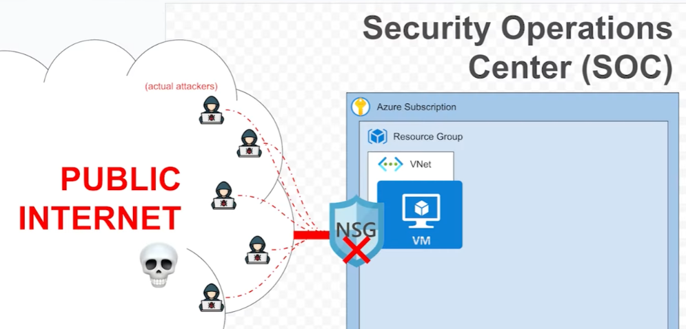

# WindowsHoneypot - Cyber Threat Intelligence Platform

> A comprehensive cybersecurity learning project demonstrating honeypot deployment, attack simulation, automated response, and threat intelligence analysis using Azure cloud services.

## Project Objectives
- Deploy honeypot infrastructure
- Analyze cyber attack patterns
- Build automated threat detection and response systems
- Develop threat intelligence capabilities
- Master Azure Sentinel SIEM operations

## Architecture

	

## Project Phases

### Phase 1: Basic Honeypot Deployment 
- [View Documentation](docs/01-basic-setup.md)
- Azure VM deployment
- Network security configuration
- Log Analytics integration
- Basic KQL analysis

**Results:** 60,000+ failed authentication attempts in <1 hour

### Phase 2: Geolocation Analysis 
- [View Documentation](docs/02-geolocation-analysis.md)
- IP geolocation mapping
- Interactive attack visualization

### Phase 3: Attack Simulation Framework (in progress)
- [View Documentation](docs/03-attack-simulator.md)
- Custom brute-force tool development
- IP rotation capabilities
- Realistic attack pattern generation

### Phase 4: Automated Response System (in progress)
- [View Documentation](docs/04-automated-response.md)
- Real-time alert generation
- Automated IP blocking
- Incident notification system

### Phase 5: Multi-Service Honeypot (in progress)
- [View Documentation](docs/05-multi-service-honeypot.md)
- SSH honeypot deployment
- FTP honeypot integration
- Web application honeypot

## Technologies Used
- **Cloud Platform:** Microsoft Azure
- **SIEM:** Azure Sentinel
- **Query Language:** KQL (Kusto Query Language)
- **Visualization:** Azure Workbooks
- **Programming:** Python, PowerShell
- **Automation:** Azure Logic Apps, Functions

## Skills Demonstrated
- Cloud infrastructure deployment (Azure)
- Security information and event management (SIEM)
- Log analysis and threat hunting
- Automation and orchestration
- Data visualization
- Python development
- Network security concepts

## Learning Resources
- [Josh Makador's Sentinel Lab](https://github.com/joshmadakor1/Sentinel-Lab)
- [Azure Sentinel Documentation](https://docs.microsoft.com/azure/sentinel/)
- [KQL Quick Reference](https://docs.microsoft.com/azure/data-explorer/kql-quick-reference)

## License
MIT License

## Contributing
Contributions welcome! Please read [CONTRIBUTING.md](CONTRIBUTING.md) first.

⭐ If you found this project helpful, please consider starring it!
