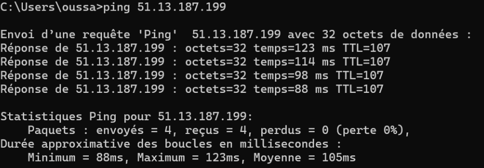
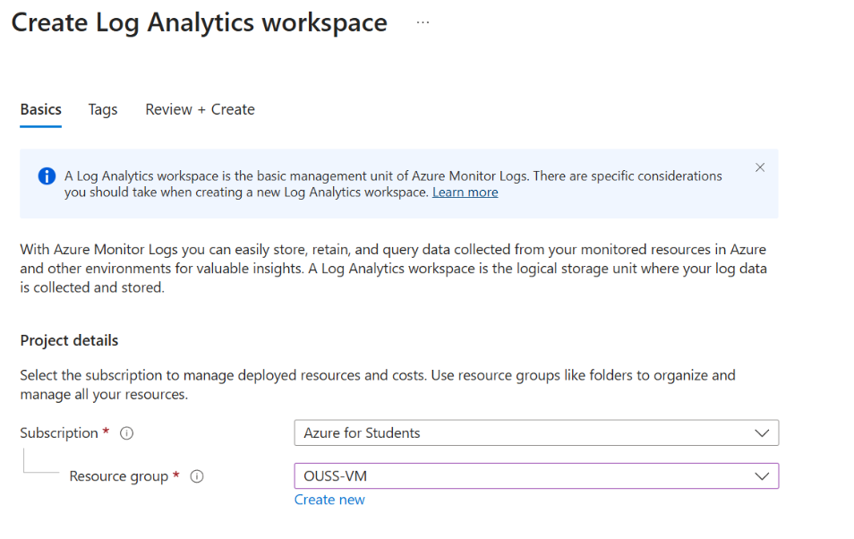
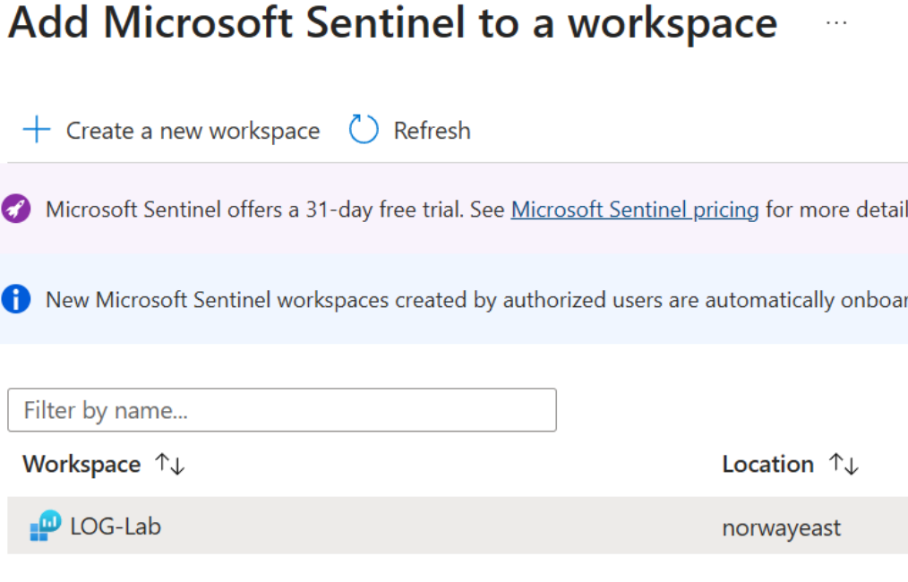
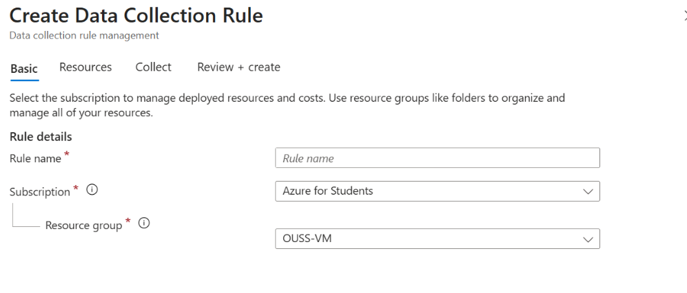
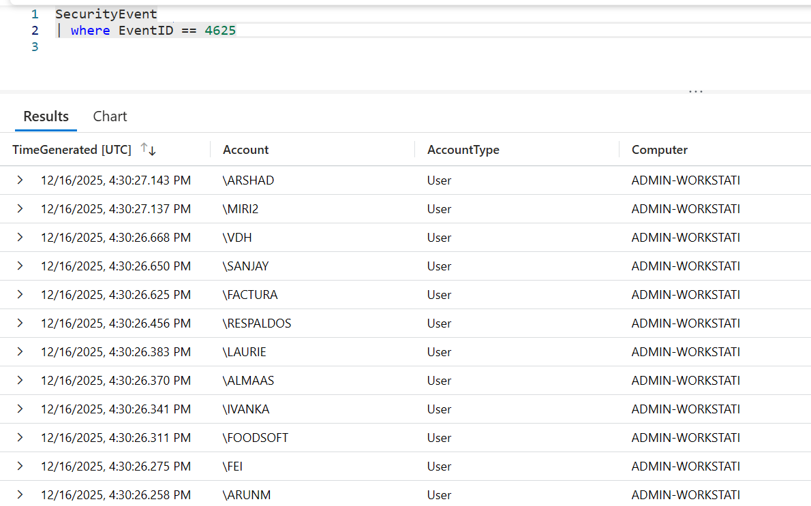
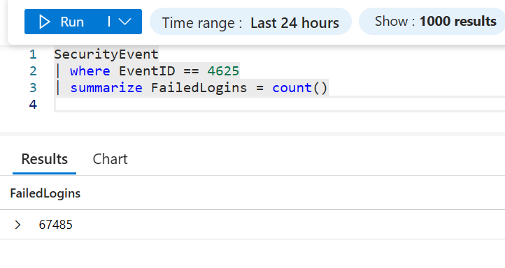
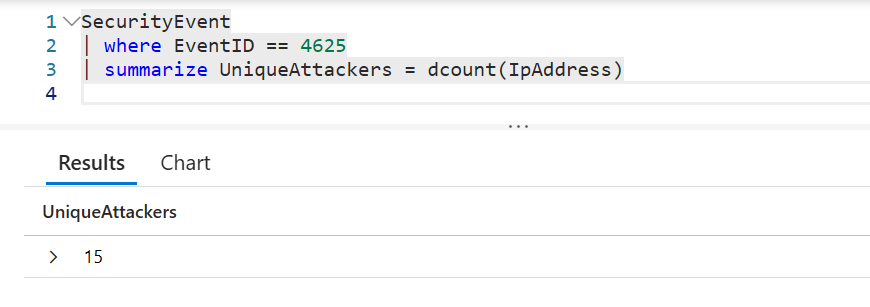
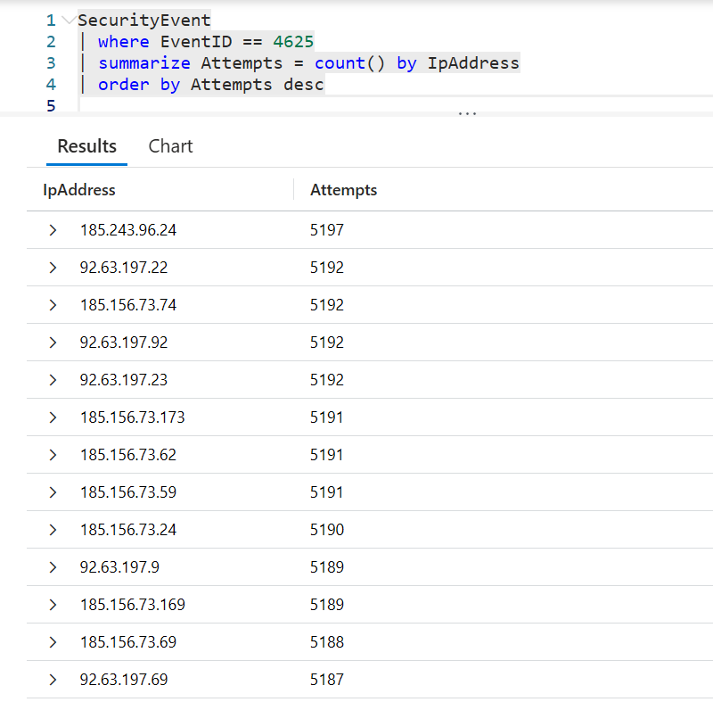
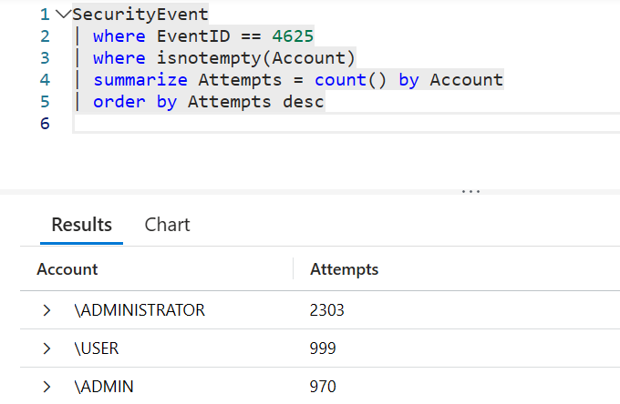

# Phase 1: Basic Honeypot Deployment

## What is a Honeypot?

A honeypot is a sacrificial computer system designed to attract cyberattacks, acting as a decoy. It mimics a target for hackers and uses their intrusion attempts to gain information about cybercriminals and their methods.

**Source:** [Kaspersky - What is a Honeypot](https://www.kaspersky.com/resource-center/threats/what-is-a-honeypot)

## Project Overview

This honeypot is an intentionally unprotected Windows VM connected to the internet that will attract attackers. We then collect and analyze the attack data using Azure Sentinel (SIEM) to track attacker behavior and learn about real-world cyber threats.

## Setup Steps

### 1. Create Azure Resource Group

A resource group is a logical container for Azure resources. All resources in this project will be organized under one resource group.

### 2. Create Virtual Network

A virtual network provides the network infrastructure for our VM to connect to the internet.

### 3. Deploy Windows Virtual Machine

* Create a Windows VM in Azure
* Connect it to the virtual network created in step 2

### 4. Configure Network Security (Make it Vulnerable)

**This will make our VM vulnerable to attacks.**

* Open Network Security Group (NSG) settings
* Add inbound security rule to allow ALL traffic:

  * Protocol: Any
  * Source: Any (*)
  * Destination: Any (*)
  * Action: Allow

### 5. Disable Windows Firewall

Connect to our VM via Remote Desktop Connection (RDP) using the public IP address, then:

* Open Windows Defender Firewall settings
* Turn off firewall for all network profiles (Domain, Private, Public)

### 6. Verify VM is Exposed

From our local machine, ping the VM's public IP address to confirm it's reachable from the internet.



### 7. Set Up Log Collection

**Create Log Analytics Workspace:**

* Navigate to Azure Portal
* Create a Log Analytics Workspace
* This will serve as our log repository



**Deploy Azure Sentinel:**

* Create Azure Sentinel instance
* Connect it to our Log Analytics Workspace



### 8. Connect VM to Logging Infrastructure

**Install Windows Security Events Connector:**

* Go to Sentinel → Content Management → Content Hub
* Install "Windows Security Events" solution
* Open the connector page


**Create Data Collection Rule:**

* Navigate to "Windows Security Events via AMA" (Azure Monitoring Agent)
* Create a new Data Collection Rule (DCR)
* Link our honeypot VM to this rule
* This forwards all security logs from our VM to Log Analytics



### 9. Analyze Logs with KQL

Once logs start flowing in (may take a few minutes), we can query them using Kusto Query Language (KQL).
The `SecurityEvent` table contains all security events forwarded by the Azure Monitor Agent from our honeypot.
**4625** is the EventId for a failed logon attempt.

```kql
SecurityEvent
| where EventId == 4625
```



Within **less than one hour** of deployment, the honeypot received **+60,000 failed authentication attempts** from multiple external sources.



**Number of unique attacker IP addresses** attempting to authenticate against the honeypot:



**Most active attacker IP addresses:**



This shows that a limited subset of sources was responsible for the majority of failed authentication attempts.
→ **Brute-force activity.**

**Most frequently targeted usernames**, typically default or administrative accounts:



This confirms the use of automated brute-force and dictionary attack tools.


## Next Phase
→ [Phase 2: Geolocation Analysis](02-geolocation-analysis.md)
