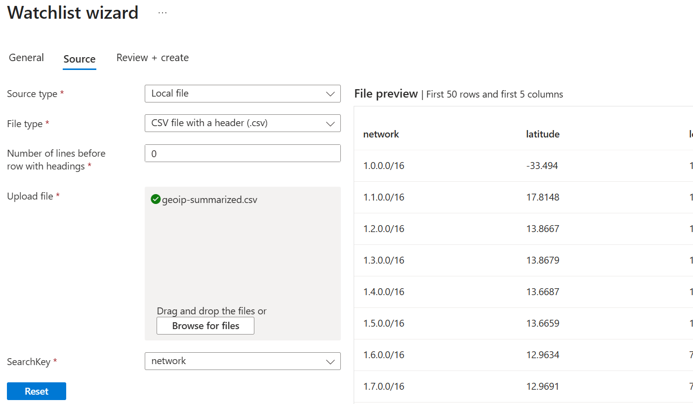
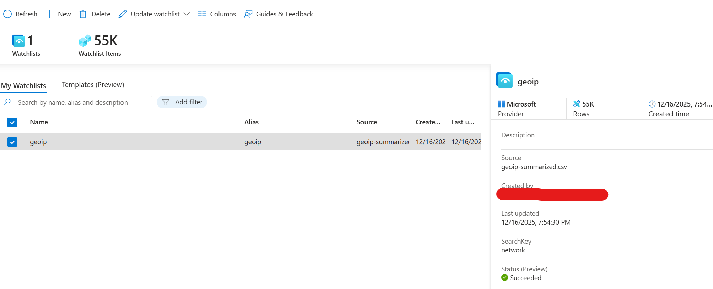
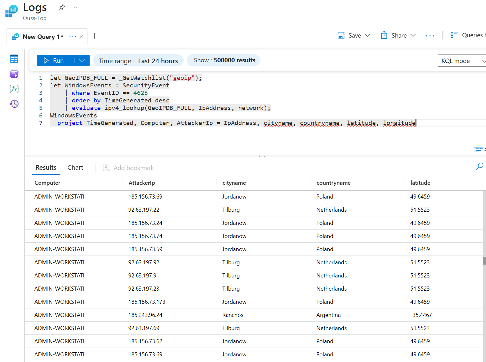
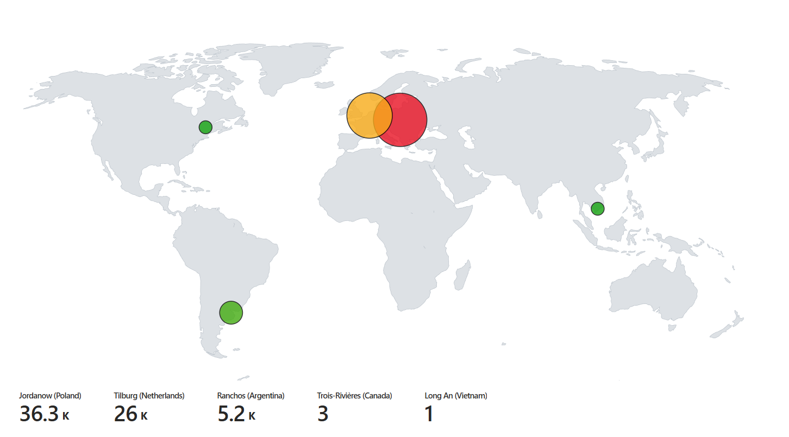

# Phase 2: Geolocation Analysis
### 1. Import Geolocation Data

To visualize where attacks are originating from, we need to map IP addresses to geographic locations.

**Obtain GeoIP Database:**

* Download a CSV file containing IP address ranges mapped to geographic locations
* Source: [Josh Makador](https://www.youtube.com/c/JoshMadakor) (highly recommended)

**Create Watchlist in Sentinel:**

* Navigate to Sentinel → Configuration → Watchlists
* Create a new watchlist:
  * Upload the geoip CSV file as the source
  * Set **Search Key** to `network`
  * Name the watchlist `geoip`



Once created, the watchlist will appear in our Sentinel configuration:



### 2. Enrich Log Data with Geolocation

Return to Log Analytics Workspace to query the enriched data.

**The following KQL query** will correlate failed login attempts with geographic locations:

```kql
let GeoIPDB_FULL = _GetWatchlist("geoip");
let WindowsEvents = SecurityEvent
    | where EventID == 4625
    | order by TimeGenerated desc
    | evaluate ipv4_lookup(GeoIPDB_FULL, IpAddress, network);
WindowsEvents
| project TimeGenerated, Computer, AttackerIp = IpAddress, cityname, countryname, latitude, longitude
```

This query:
* Loads the geoip watchlist
* Filters for failed authentication events (EventID 4625)
* Performs IP lookup to match attacker IPs with geographic data
* Projects only the relevant fields: timestamp, computer name, attacker IP, city, country, and coordinates



### 3. Create Interactive Attack Map

Now we'll visualize the attack data on a world map to see where threats are coming from in real-time.

**Create Custom Workbook:**

* Navigate to Sentinel → Workbooks
* Click **Add workbook** → **Edit**
* Remove any existing elements
* Add Query element

**Configure Map Visualization:**

* Switch to **Advanced Editor**
* Paste the following JSON configuration:

```json
{
	"type": 3,
	"content": {
	"version": "KqlItem/1.0",
	"query": "let GeoIPDB_FULL = _GetWatchlist(\"geoip\");\nlet WindowsEvents = SecurityEvent;\nWindowsEvents | where EventID == 4625\n| order by TimeGenerated desc\n| evaluate ipv4_lookup(GeoIPDB_FULL, IpAddress, network)\n| summarize FailureCount = count() by IpAddress, latitude, longitude, cityname, countryname\n| project FailureCount, AttackerIp = IpAddress, latitude, longitude, city = cityname, country = countryname,\nfriendly_location = strcat(cityname, \" (\", countryname, \")\");",
	"size": 3,
	"timeContext": {
		"durationMs": 2592000000
	},
	"queryType": 0,
	"resourceType": "microsoft.operationalinsights/workspaces",
	"visualization": "map",
	"mapSettings": {
		"locInfo": "LatLong",
		"locInfoColumn": "countryname",
		"latitude": "latitude",
		"longitude": "longitude",
		"sizeSettings": "FailureCount",
		"sizeAggregation": "Sum",
		"opacity": 0.8,
		"labelSettings": "friendly_location",
		"legendMetric": "FailureCount",
		"legendAggregation": "Sum",
		"itemColorSettings": {
		"nodeColorField": "FailureCount",
		"colorAggregation": "Sum",
		"type": "heatmap",
		"heatmapPalette": "greenRed"
		}
	}
	},
	"name": "query - 0"
}
```

* Save the workbook



**Result:** An interactive heat map showing:
* Attack origins by geographic location
* Attack intensity indicated by color (green to red)
* Bubble size representing the number of failed authentication attempts per location
* Real-time updates as new attacks occur

The map will continue to update in real-time as long as the honeypot VM remains active.


## Next Phase
→ [Phase 3: Attack Simulator](03-attack-simulator.md)
